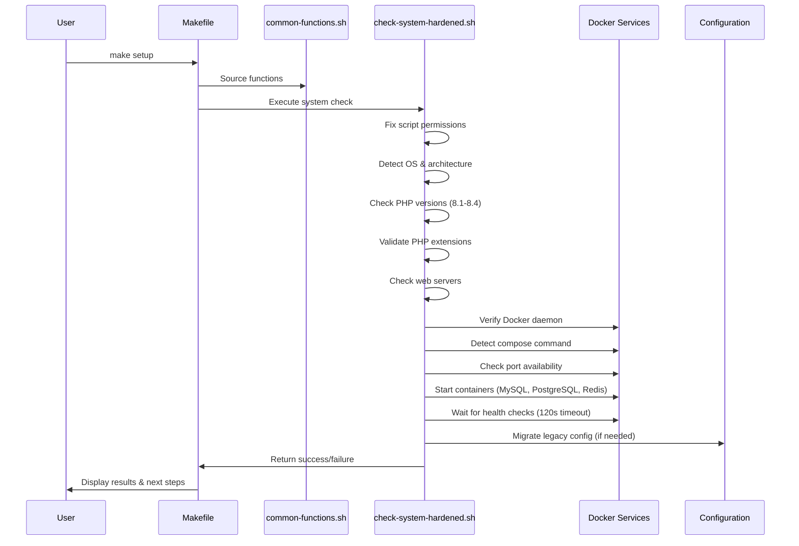
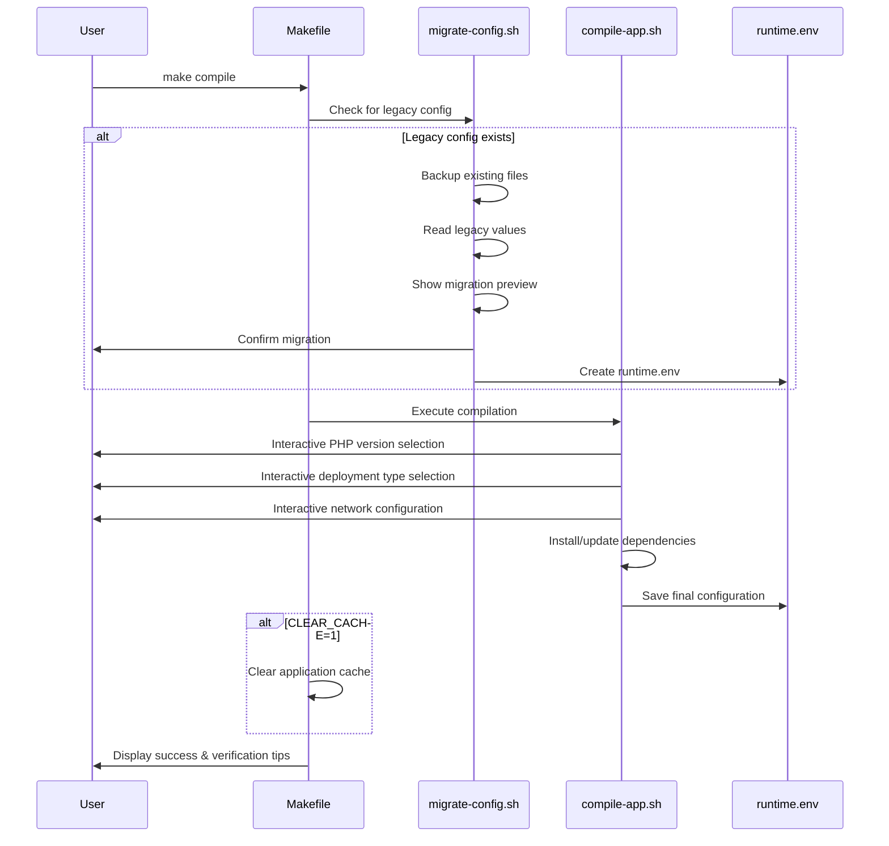
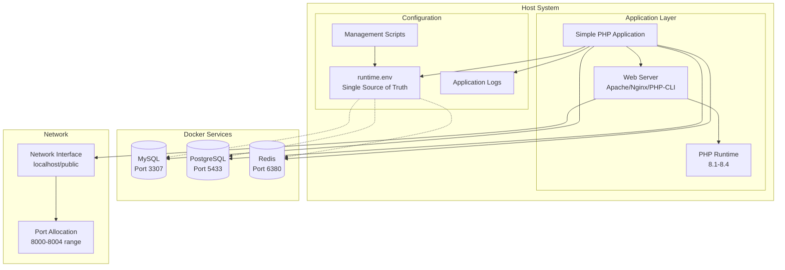

# Simple PHP - Operational Guide

## 📋 Overview

This document provides operational guidance for the Simple PHP application, including architecture diagrams, troubleshooting procedures, and maintenance workflows.

## 🏗️ Architecture Overview

The Simple PHP application follows a containerized architecture with isolated services and configurable deployment types.

## 🔄 Make Setup Flow



## 🔧 Make Compile Flow



## 📊 Application Architecture



## 🛠️ Configuration Management

### **Primary Configuration**
- **File**: `config/runtime.env`
- **Purpose**: Single source of truth for all settings
- **Format**: Shell environment variables
- **Validation**: Automatic during `make compile`

### **Configuration Hierarchy**
1. `config/runtime.env` (primary)
2. `config/local.env` (local overrides, gitignored)
3. Environment variables (runtime overrides)
4. Makefile defaults (fallback)

### **Key Configuration Sections**
- Application settings (name, port, PHP version)
- Database connections (MySQL, PostgreSQL, Redis)
- Web server configuration (Apache, Nginx, PHP-FPM)
- Docker service settings
- Security and resource limits

## 🔍 Troubleshooting Guide

### **Common Issues and Solutions**

#### **1. Setup Failures**

**Symptom**: `make setup` fails with Docker errors
```bash
❌ [setup] failed: Docker daemon not running
```

**Diagnosis**:
```bash
# Check Docker status
sudo systemctl status docker
docker info

# Check Docker Compose
docker compose version
docker-compose version
```

**Solution**:
```bash
# Start Docker daemon
sudo systemctl start docker
sudo systemctl enable docker

# Install Docker Compose v2
sudo apt install docker-compose-plugin

# Verify installation
make setup VERBOSE=1
```

#### **2. Port Conflicts**

**Symptom**: Container startup fails with port binding errors
```bash
❌ Port 3307 is already in use by: mysqld
```

**Diagnosis**:
```bash
# Check port usage
ss -tlnp | grep :3307
netstat -tlnp | grep :3307

# Find process using port
sudo lsof -i :3307
```

**Solution**:
```bash
# Stop conflicting service
sudo systemctl stop mysql

# Or change ports in configuration
make compile
# Select different ports during configuration

# Force cleanup and restart
REMOVE_VOLUMES=1 make down
make setup
```

#### **3. PHP Version Issues**

**Symptom**: Compilation fails with PHP version errors
```bash
❌ PHP 8.4 not found on system
```

**Diagnosis**:
```bash
# Check available PHP versions
php --version
php8.1 --version
php8.2 --version
php8.3 --version
php8.4 --version

# Check PHP extensions
php -m | grep -E "(mysql|pgsql|redis)"
```

**Solution**:
```bash
# Install missing PHP version (Ubuntu/Debian)
sudo apt update
sudo apt install php8.4 php8.4-cli php8.4-fpm
sudo apt install php8.4-mysql php8.4-pgsql php8.4-redis

# Install missing PHP version (RHEL/CentOS)
sudo yum install php84 php84-cli php84-fpm
sudo yum install php84-mysql php84-pgsql php84-redis

# Verify installation
make php-status
```

#### **4. Configuration Issues**

**Symptom**: Application fails to start with configuration errors
```bash
❌ Configuration file not found: config/runtime.env
```

**Diagnosis**:
```bash
# Check configuration files
ls -la config/
cat config/runtime.env

# Validate configuration syntax
bash -n config/runtime.env
```

**Solution**:
```bash
# Regenerate configuration
make compile

# Migrate from legacy configuration
./scripts/migrate-config.sh

# Use template as starting point
cp config/app.env.example config/runtime.env
make compile
```

#### **5. Container Health Issues**

**Symptom**: Containers start but fail health checks
```bash
❌ Container health check timeout after 120s
```

**Diagnosis**:
```bash
# Check container status
docker ps -a
docker compose ps

# Check container logs
docker compose logs mysql
docker compose logs postgres
docker compose logs redis

# Check container health
docker inspect simple_php_mysql | grep -A 10 Health
```

**Solution**:
```bash
# Restart containers with fresh volumes
REMOVE_VOLUMES=1 make down
make setup

# Increase health check timeout
export DOCKER_HEALTH_TIMEOUT=300
make setup

# Check system resources
df -h
free -h
```

### **Diagnostic Commands**

#### **System Status**
```bash
# Comprehensive status check
make status

# PHP diagnostics
make php-status

# Network diagnostics
make network-status

# Verbose logging
VERBOSE=1 make setup
VERBOSE=1 make compile
VERBOSE=1 make start
```

#### **Docker Diagnostics**
```bash
# Container status
docker ps -a
docker compose ps

# Container logs
docker compose logs --tail=50

# Container resource usage
docker stats --no-stream

# Network inspection
docker network ls
docker network inspect simple_php_network
```

#### **Configuration Diagnostics**
```bash
# Show current configuration
cat config/runtime.env

# Validate configuration
bash -n config/runtime.env

# Show configuration differences
diff config/runtime.env config/app.env.example

# Check environment variables
env | grep -E "(APP_|PHP_|MYSQL_|POSTGRES_|REDIS_)"
```

### **Log Analysis**

#### **Application Logs**
```bash
# Application logs
tail -f logs/application.log

# Script execution logs
tail -f logs/check-system-hardened.log
tail -f logs/compile-app.log
tail -f logs/start-app.log
```

#### **Docker Logs**
```bash
# All container logs
docker compose logs -f

# Specific service logs
docker compose logs -f mysql
docker compose logs -f postgres
docker compose logs -f redis
```

### **Performance Monitoring**

#### **Resource Usage**
```bash
# Container resources
docker stats --no-stream

# System resources
top
htop
free -h
df -h

# Network usage
ss -tuln
netstat -tuln
```

#### **Application Performance**
```bash
# PHP process monitoring
ps aux | grep php

# Web server status
systemctl status apache2
systemctl status nginx

# Database connections
mysql -h localhost -P 3307 -u root -p -e "SHOW PROCESSLIST;"
```

## 🚀 Maintenance Procedures

### **Regular Maintenance**
```bash
# Update dependencies
composer update

# Clear caches
CLEAR_CACHE=1 make compile

# Rotate logs
logrotate -f /etc/logrotate.d/simple-php

# Update Docker images
docker compose pull
make down
make setup
```

### **Backup Procedures**
```bash
# Backup configuration
cp config/runtime.env config/runtime.env.backup

# Backup database
docker exec simple_php_mysql mysqldump -u root -p simple_php_db > backup.sql

# Backup application data
tar -czf simple-php-backup.tar.gz config/ logs/ cache/
```

### **Recovery Procedures**
```bash
# Restore configuration
cp config/runtime.env.backup config/runtime.env

# Restore database
docker exec -i simple_php_mysql mysql -u root -p simple_php_db < backup.sql

# Complete reset
REMOVE_VOLUMES=1 CLEAR_CACHE=1 make down
make setup
make compile
make start
```

This operational guide provides comprehensive procedures for managing the Simple PHP application in development and production environments.
